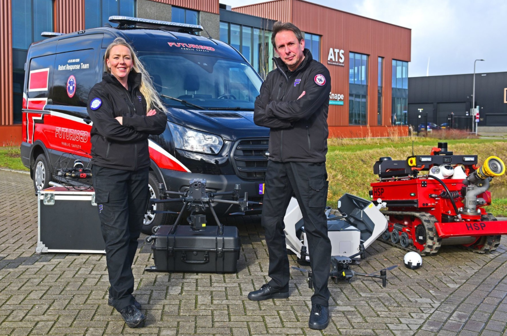

# Project Team WaterBenders
*15/06/2026* 

Team Waterbenders 
Hogeschool Utrecht 
Futurised 

# Table of Contents
- [Project Team WaterBenders](#project-team-waterbenders)
- [Table of Contents](#table-of-contents)
- [Project authors](#project-authors)
- [Connections](#connections)
- [Introduction](#introduction)
- [Assignment](#assignment)
  - [Main implementations](#main-implementations)
  - [Other implementations](#other-implementations)
  - [Software](#software)
- [Futurised](#futurised)
- [Navigation](#navigation)

# Project authors
- Django Manders
- Freya van den Berg
- Maud Waasdorp
- Radeiaan Nandoe
- Sarah Gbagi

# Connections
- Robbert Heinecke
- Juliette Kraal
- Bart Bozon
- Hasan Kurt

# Introduction
Welcome to the Hogeschool Utrecht project for the TI-students, Team Waterbenders. During this project the team developed, researched, tested, implemented and created a Digital Twin for the client, Futurised. The Digital Twin is based on their real-life robot FLIP, FLIP is a robot that can navigate and scan an environment and even extinguish fires. 

In order to satisfy the clients' needs, the team did research and created multiple prototypes to come to the concluding product for Futurised. By communicating frequently and showcasing multiple prototypes with the client, the team was able to fullfill the clients' requirements and wishes.

This repository is a transfer website for future project teams and Futurised to continue building and improving on this Digital Twin. 

# Assignment
## Main implementations
The most important requirement for FLIP from the client was **autonomus driving** and e**xploring environments**. Besides those, the team also implemented a few other things to bring the Digital Twin to the next level:
- **LiDAR 3D-mapping** including saved scans, in order te revisit the environment later on.
- **Object, human and fire detection**, in order to correctly assess situaitions in the environment.
- **Pathfinding algorithm**, in order to autonomusly manouvre and explore the environment in an effective way.

## Other implementations
Besides those main implementations, other sensors were implemented in FLIP:
- **Logical Audio Sensor:** in order to receive and send audio data.
- **Airpressure sensor:** in order to detect different airpressures in the environment.
- **Dijkstra Algorithm:** in order to have a back-up algorithm for FLIP to manouvre and explore autonomusly.
- **Ultra-wide camera:** in order to see a live-feed of the environment.
- **Thermal camera:** in order to see a live-feed of different temperatures inside an environment.

--- 
## Software
This Digital Twin is made using the following software:
- Python
- ROS2
- RViz
- Colcon
- Docker

Please read the [navigation](#navigation) chapter below to learn how to navigate, read and use this repository accordingly.

# Futurised
Futurised is a private first responder organization operating 24/7 to support first responders during incidents. They enhance situational awareness through the use of smart technologies such as digital applications, drones, sensors, and robots. 

They help organizations operate in a future-proof, safe, and efficient way. Futurised turns ideas into results, from operational concepts and AI tools to project support and strategic guidance.

Futurised also develops innovative (digital) products that support first responders in operating more safely and efficiently. They also provide a platform where innovations come together, making it easy for first responders to find what they need.

**Communication with Futurised was always with Robbert Heinecke and Juliette Kraal, both co-founders of Futurised.**

Check out the [Futurised Website](https://www.getfuturised.com/), also check out their article on [Crisimanager](https://crisismanager.nl/drones-en-grondrobotica-digitale-verkenning-krijgt-europees-perspectief) to see FLIP in action.

# Navigation
Since this project had alot of prototypes and some particular usage for it to work accordingly, there are some documentation and guides to follow.

These are the folders and their contents:
- [docker](/docker): How-To setup and use Docker and setup the environment to work in *(required to run the simulation)*.
- [docs](/docs): Documentation like specifications on FLIP, research documents and the development document.
- [setup](/setup): How-To setup and use different software like ROS2, Colcon, RViz and running Python files *(required to run the simulation)*.
