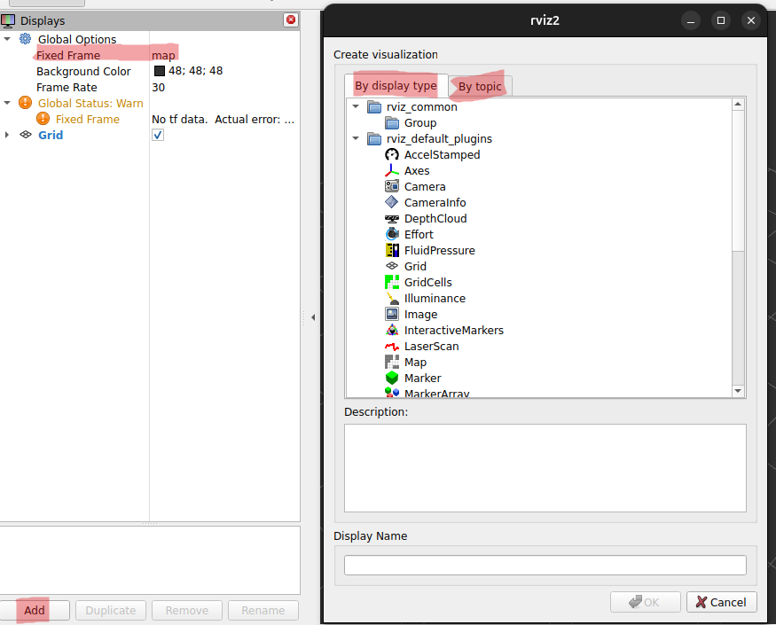
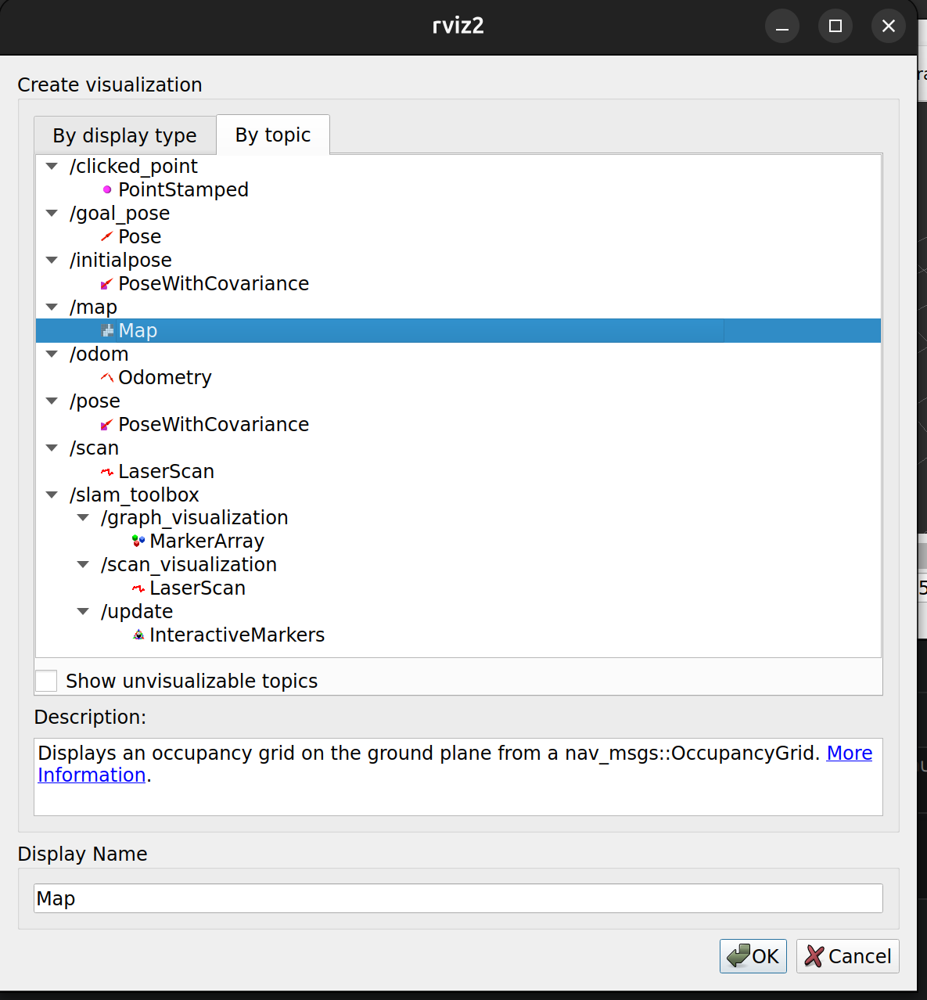
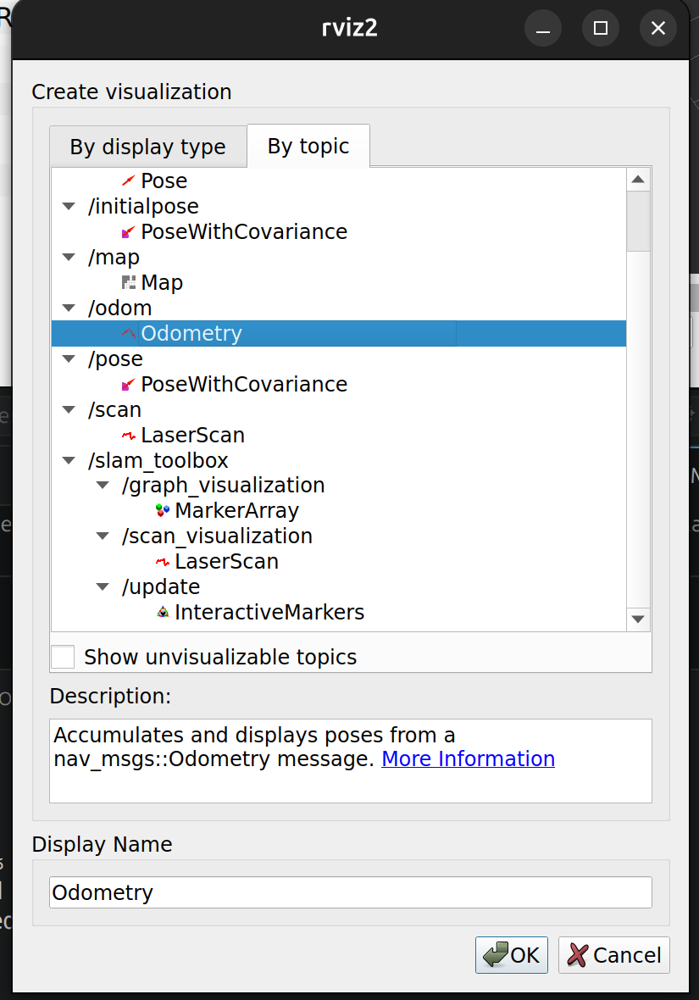

# ChatGPT Links
- [Research](https://chatgpt.com/share/69d0f87b-45e4-838c-94b0-efe0e829e8b6)
- [ROS2 Setup convo](https://chatgpt.com/share/69d0cd11-8ca0-8393-882a-e5a7e2e762e5)
- [ROS2 Lidar Setup convo](https://chatgpt.com/share/69d11c85-56a4-8385-b038-4376ad1532e0)

# Context
This README documents the steps taken to achieve 2D-mapping using a LiDAR sensor, ROS2, and RViz in a simulated environment.

ROS2 was chosen because it is widely used for processing and managing simulation data, making it the natural fit for this prototype. RViz was selected as the visualisation tool based on findings during [initial research](../../../documenten/onderzoek/ROS2/bridge.md), as it integrates well with ROS2 and supports real-time display of LiDAR and map data.

This prototype was a first step towards using LiDAR sensor data to generate a 2D map of a simulated environment using SLAM (Simultaneous Localisation and Mapping). It was developed during sprint 3 as agreed upon with the stakeholder (opdrachtgever).

# Context
This prototype builds on the earlier `workspace/prototypes/omgeving-met-obstakels` by introducing a more realistic simulated environment with obstacles. The goal was to test how well the robot and its sensors handle a populated environment, rather than an empty room.

To keep the simulation setup maintainable, the model was split up into separate reusable "plugins" and obstacle models rather than one large monolithic `.sdf` file.

---

# Model Structure

## Robot — `models/gazebo/flip/model.sdf`
The FLIP robot model. Sensors are not defined directly inside this file but are attached to it as separate plugin snippets from `models/gazebo/plugins/`.

## Sensor Plugins — `models/gazebo/plugins/`
Each sensor is defined as its own `.sdf` plugin file that gets attached to the FLIP robot model:

| File | Sensor |
|---|---|
| `lidar_sensor.sdf` | GPU LiDAR (`gpu_lidar`) |
| `front_camera.sdf` | Front-facing camera |
| `rear_camera.sdf` | Rear-facing camera |
| `thermal_camera.sdf` | Thermal camera |
| `logical_audio_sensor.sdf` | Logical audio sensor |

## Obstacles — `models/gazebo/obstacles/`
Obstacles are defined as individual Gazebo models, organised into two categories:

- **`shapes/`** — simple geometric shapes (boxes, spheres, cylinders) for basic obstacle testing
- **`walls/`** — wall segments for constructing room layouts

## Environment — `models/gazebo/environment.sdf`
The main world file. It includes the obstacle models from `models/gazebo/obstacles/` to compose the full simulated environment. The people models were included using online model links.


## Prototype Files — `prototypes/omgeving-met-obstakels/`
| File | Description |
|---|---|
| `omgevingV1.sdf` | First version of the obstacle room simulation |
| `kamer/kamerV1.sdf` | First version of the modular room layout used in the simulation |


# 1.) Setup
1. Setting up ROS & SLAM
- prepare the container
    ```bash
    apt update
    apt install -y locales curl gnupg2 lsb-release software-properties-common

    locale-gen en_US en_US.UTF-8
    update-locale LC_ALL=en_US.UTF-8 LANG=en_US.UTF-8
    export LANG=en_US.UTF-8
    ```

- add ROS 2 Jazzy repository
    ```bash
    add-apt-repository universe -y
    apt update

    curl -sSL https://raw.githubusercontent.com/ros/rosdistro/master/ros.key \
    -o /usr/share/keyrings/ros-archive-keyring.gpg

    echo "deb [arch=$(dpkg --print-architecture) signed-by=/usr/share/keyrings/ros-archive-keyring.gpg] \
    http://packages.ros.org/ros2/ubuntu noble main" \
    > /etc/apt/sources.list.d/ros2.list
    ```
    

- install ROS 2 Jazzy Desktop, SLAM toolbox and other tools
    ```bash
    apt update && apt install -y ros-jazzy-desktop ros-jazzy-ros-gz ros-jazzy-ros-gz-bridge ros-jazzy-ros-gz-sim ros-jazzy-slam-toolbox ros-jazzy-teleop-twist-keyboard ros-jazzy-rviz2 ros-jazzy-nav2-map-server
    ```

- Source ROS2. Note: You will need to type this everytime you wish to use a terminal that can run `ros` commands!!
    ```bash
    source /opt/ros/jazzy/setup.bash
    ```

- additional optional tools installation
    ```bash
    apt update && apt install ros-jazzy-joint-state-publisher ros-jazzy-joint-state-publisher-gui ros-jazzy-xacro 
    ```

---

# 2.) Running files:
## 2.1) Running .sdf file with teleop for driving only
### Terminal 1 - starting gazebo

```bash
gz sim nameOfYourFile.sdf
```


### Terminal 2 - bridging Twist messages

```bash
source /opt/ros/jazzy/setup.bash
ros2 run ros_gz_bridge parameter_bridge \
/model/FLIP/cmd_vel@geometry_msgs/msg/Twist@gz.msgs.Twist
```


### Terminal 3 - running teleop for steering

```bash
source /opt/ros/jazzy/setup.bash
ros2 run teleop_twist_keyboard teleop_twist_keyboard \
  --ros-args -r cmd_vel:=/model/FLIP/cmd_vel
```
---

## 2.2) Running files for Lidar mapping using 4 terminals
### Terminal 1 — start Gazebo

```bash
cd /workspace/prototypes/lidarSensorOmgeving/
gz sim lidarRoomScan.sdf
```

### Terminal 2 — start bridge + static TF + SLAM

```bash
cd /workspace/prototypes/lidarSensorOmgeving/
source /opt/ros/jazzy/setup.bash
ros2 launch /workspace/prototypes/lidarSensorOmgeving/slam_gazebo.launch.py
```

### Terminal 3 — start RViz

```bash
cd /workspace/prototypes/lidarSensorOmgeving/
source /opt/ros/jazzy/setup.bash
rviz2
```

In RViz:

* set **Fixed Frame** to `map`
* **Add**:

  * `Map` from under `By Topic`
  

  * `LaserScan` with topic `/scan`  from under `By Topic`
  

  * `Odometry` with topic `/odom` from under `By Topic`
  

  * `TF` from under `By display type`
  


### Terminal 4 — drive the robot

**If your bridge YAML includes `/cmd_vel` to `/model/FLIP/cmd_vel`:**

```bash
cd /workspace/prototypes/lidarSensorOmgeving/
source /opt/ros/jazzy/setup.bash
ros2 run teleop_twist_keyboard teleop_twist_keyboard --ros-args -r /cmd_vel:=/cmd_vel
```

If instead you did not bridge to ROS topic `/cmd_vel` but directly to `/model/FLIP/cmd_vel`, then use:

```bash
cd /workspace/prototypes/lidarSensorOmgeving/
source /opt/ros/jazzy/setup.bash
ros2 run teleop_twist_keyboard teleop_twist_keyboard --ros-args -r /cmd_vel:=/model/FLIP/cmd_vel
```


---
## 2.3) Running files for Lidar mapping like above in 2.2 but with 6 commands

### Terminal 1 — Start Gazebo

```bash
cd /workspace/prototypes/lidarSensorOmgeving/
gz sim roomWithObjects.sdf
```

Press **Play** in Gazebo if needed

---

### Terminal 2 — Start ROS ↔ Gazebo bridge

```bash
cd /workspace/prototypes/lidarSensorOmgeving/
source /opt/ros/jazzy/setup.bash

ros2 run ros_gz_bridge parameter_bridge \
--ros-args -p config_file:=/workspace/prototypes/lidarSensorOmgeving/rosBridge.yaml
```

---

### Terminal 3 — Static TF for LiDAR

```bash
cd /workspace/prototypes/lidarSensorOmgeving/
source /opt/ros/jazzy/setup.bash

ros2 run tf2_ros static_transform_publisher \
0.6 0 0.3 0 0 0 base_link FLIP/chassis/gpu_lidar
```

This creates:

```
base_link → FLIP/chassis/gpu_lidar
```

---

### Terminal 4 — Start SLAM Toolbox

```bash
cd /workspace/prototypes/lidarSensorOmgeving/
source /opt/ros/jazzy/setup.bash

ros2 launch slam_toolbox online_async_launch.py \
slam_params_file:=/workspace/prototypes/lidarSensorOmgeving/mapper_params_online_async.yaml \
use_sim_time:=true
```

---

### Terminal 5 — Start RViz

```bash
cd /workspace/prototypes/lidarSensorOmgeving/
source /opt/ros/jazzy/setup.bash

rviz2
```

#### In RViz:

* Fixed Frame → `map`
* **Add**:

  * Map
  * LaserScan → `/scan`
  * TF
  * Odometry

---

### Terminal 6 — Drive the robot

```bash
cd /workspace/prototypes/lidarSensorOmgeving/
source /opt/ros/jazzy/setup.bash

ros2 run teleop_twist_keyboard teleop_twist_keyboard \
--ros-args -r /cmd_vel:=/cmd_vel
```
---


# 3.) Options:
1. Permanent sourcing(**not recommended!**) so no need to type `source /opt/ros/jazzy/setup.bash` before every `ros` command 
    ```bash
    echo 'source /opt/ros/jazzy/setup.bash' >> ~/.bashrc
    source ~/.bashrc
    ```