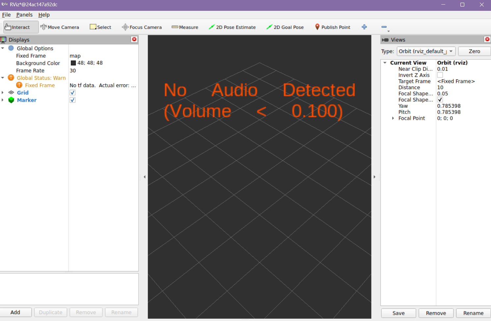

# How to visualize Logical Audio Data in RViz2

First you have to make sure a virtual environment is created by:

```
python3 -m venv /workspace/venv --system-site-packages
```

You active the venv with:
```
source /workspace/venv/bin/activate
```

To visualize the data we will first run the Gazebo environment: <br>
**Terminal 1:**
```
cd models/gazebo
gz sim environment.sdf&
```

Then we will do the Python Processing Node: <br>
**Terminal 2:**
```
cd models/scripts/logical-audio-sensor/

source /workspace/venv/bin/activate

source /opt/ros/jazzy/setup.bash

python3 audio.py
```

At last, well set up the RViz2 Visualization: <br>
**Terminal 3:**
```
source /opt/ros/jazzy/setup.bash
ros2 run rviz2 rviz2
```

Here, we will add the Logical Audio Sensor topic to visualize the data.

Within RViz you should chick on **add**, and then you should select **By topic**.
The topic you should click on is named **/robot_audio_status**, then click on **marker**, and then finnally press Ok.

If everything worked correctly you should now be able to see the data in a green font on the screen!


The highest the detected audio can go is 1.0. The further away the car is, the lower the value is.

When the audio that is being detected is lower than 0.100, you will see *No Audio Detected*. This is because the Logical Audio Sensor cannot detect lower than 0,100.



